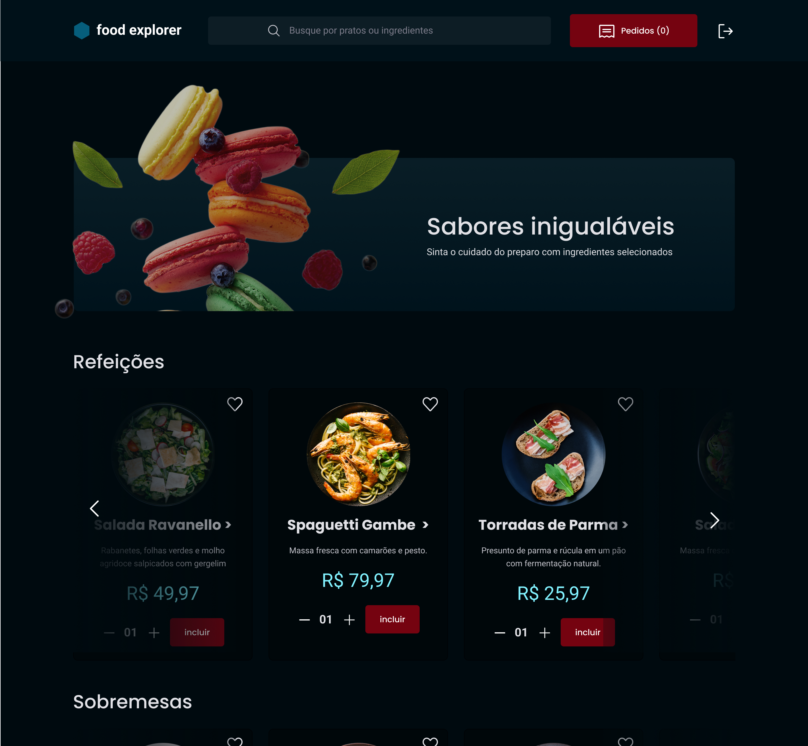
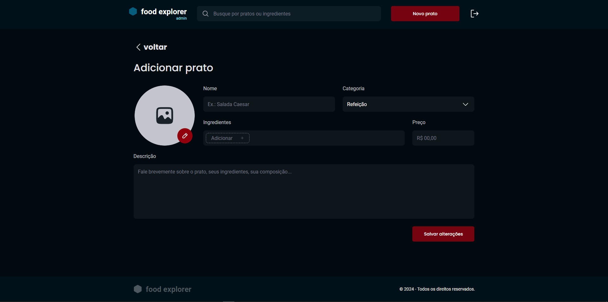
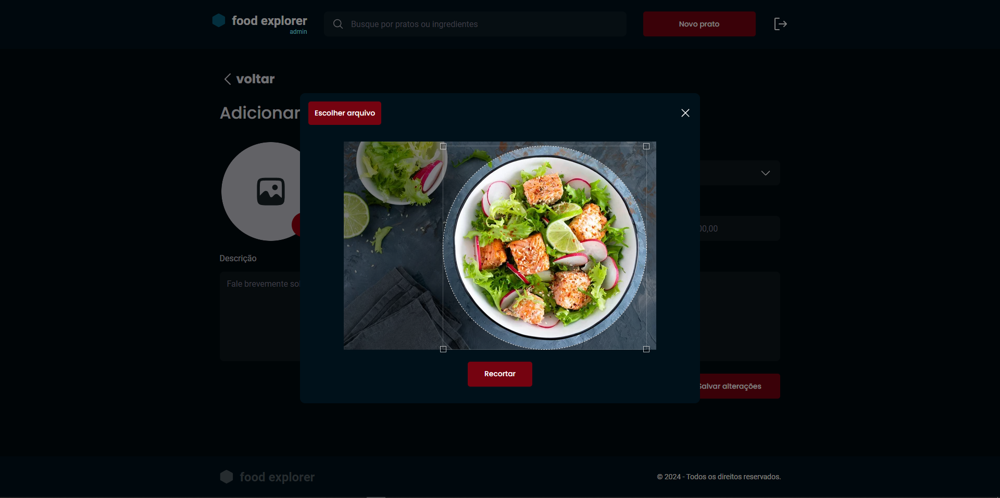
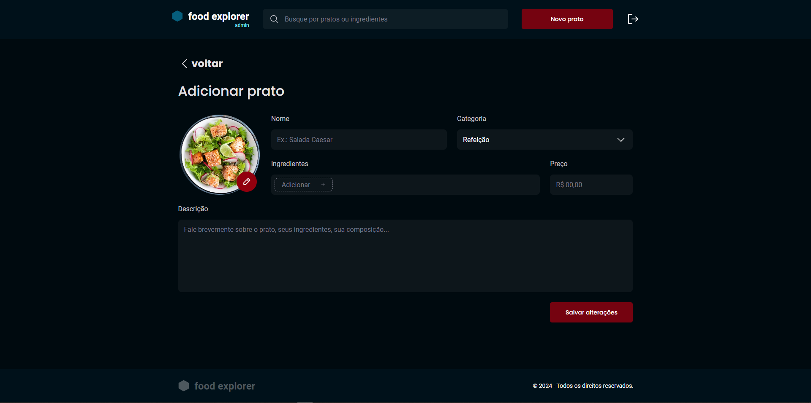

# food explorer

Desenvolvimento do projeto food explorer, um menu interativo para um restaurante fictício.



## 🚀 Tecnologias

Esse projeto foi desenvolvido com as seguintes tecnologias:

- HTML
- CSS
- JavaScript
- React
- Vite
- Styled Components
- Axios
- React Crop
- React Slick

## 💻 Projeto

O projeto FoodExplorer consiste em uma aplicação para um restaurante, onde o cliente terá acesso a um menu com todos os pratos oferecidos pelo administrador do site, que realiza a edição desses pratos. O site possui um layout bem interativo, pensado em trazer uma boa experiência ao usuário, tanto na versão desktop quanto na versão mobile.


- [Acesse o projeto finalizado, online](https://food-explorer-brunobrsl.netlify.app/)


## ✂️ Componente de Recortar Imagens

Foi implementado um componente para recortar as imagens e adicioná-las ao produto, ele também realiza uma verificação para checar se a imagem escolhida respeita o tamanho mínimo definido.





## 📁 Executar o front-end

Entre na pasta web
```bash
cd web
```

Instale as dependências
```bash
$ npm install
```

Execute a aplicação
```bash
$ npm run dev
```

## 📁 Executar o back-end

Para definir as variáveis de ambiente, utilize o arquivo .env.example como modelo.

Entre na pasta api
```bash
cd api
```

Instale as dependências
```bash
$ npm install
```

Inicie o servidor
```bash
$ npm run dev
```

## 🔗 Links
[](https://www.linkedin.com/in/brunobrsl/)